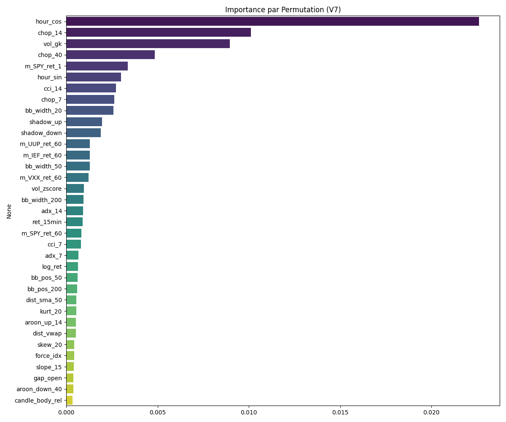

# 📈 FinanceAI Intraday (V7)

Ce projet implémente un pipeline de **Trading Quantitatif** complet pour le trading intraday sur actions américaines et crypto-monnaies. Il dépasse les approches "Retail" classiques en intégrant des concepts issus de la recherche institutionnelle (SOTA) : **Volatilité Garman-Klass**, **Microstructure (Shadows)**, **Focal Loss** et **Optimisation de Seuil**.

L'architecture repose sur un **Transformer** (Encoder) conçu pour battre le hasard de manière significative sur un horizon de ~3h (180 minutes).

---

## ⚙️ Pipeline du Projet

Le flux de travail est divisé en scripts modulaires pour garantir la propreté des données et éviter le "Data Leakage".

1.  **`collect_data.py`** : Récupération des données brutes (OHLCV) via API (Tiingo). Gère les limites de requêtes et la reprise sur erreur.
2.  **`enrich_data.py`** : Calcul de 87 features stationnaires. Utilisation de ratios et de logs pour garantir que les données de 2022 sont mathématiquement comparables à celles de 2025.
3.  **`select_features.py`** : Sélection des meilleures variables via **Permutation Importance** (et non plus Gini), éliminant la colinéarité.
4.  **`train_transformer.py`** : Entraînement avec gestion mémoire tf.data, **Mixed Precision (RTX Optimized)**, et pondération des classes "Lava Floor" (pour forcer la prise de décision).
5.  **`optimize_threshold.py`** : Le cœur de la stratégie. Scanne les probabilités de sortie pour trouver le seuil qui maximise l'Edge mathématique.

---

## 📊 Données & Dataset

Le dataset couvre la période **Janvier 2022 - Novembre 2025**.

### Stocks (Dossier `data_1min`)
Données minutieuses sur des actions tech volatiles.

| Ticker | Début | Fin | Statut |
| :--- | :--- | :--- | :--- |
| **NVDA** | 2022-01-31 | 2025-11-20 | ✅ EXCELLENT |
| **AMD** | 2022-01-31 | 2025-11-20 | ✅ EXCELLENT |
| **TSLA** | 2022-01-31 | 2025-11-20 | ✅ EXCELLENT |
| **COIN** | 2022-01-31 | 2025-11-20 | ✅ EXCELLENT |
| **SHOP** | 2022-01-31 | 2025-11-20 | ✅ EXCELLENT |
| **PLTR** | 2022-01-31 | 2025-11-20 | ✅ EXCELLENT |
| **SNOW** | 2022-01-31 | 2025-11-20 | ✅ EXCELLENT |
| **NET** | 2022-01-10 | 2025-11-20 | ✅ EXCELLENT |
| **U** | 2022-02-03 | 2025-11-20 | ✅ EXCELLENT |
| **RIVN** | 2022-02-03 | 2025-11-20 | ✅ EXCELLENT |
| **LCID** | 2022-02-03 | 2025-11-20 | ✅ EXCELLENT |
| **PLUG** | 2022-02-03 | 2025-11-20 | ✅ EXCELLENT |
| **ENPH** | 2022-02-03 | 2025-11-20 | ✅ EXCELLENT |
| **MRNA** | 2022-02-03 | 2025-11-20 | ✅ EXCELLENT |
| **CRSP** | 2022-02-03 | 2025-11-20 | ✅ EXCELLENT |
| **TDOC** | 2022-02-03 | 2025-11-20 | ✅ EXCELLENT |
| **AMC** | 2022-02-03 | 2025-11-20 | ✅ EXCELLENT |
| **GME** | 2022-02-03 | 2025-11-20 | ✅ EXCELLENT |
| **SPCE** | 2022-02-03 | 2025-11-20 | ✅ EXCELLENT |
| **MARA** | 2022-02-03 | 2025-11-20 | ✅ EXCELLENT |
| **MSTR** | 2022-02-03 | 2025-11-20 | ✅ EXCELLENT |

### Macro & Crypto (Dossier `data_macro_1min`)
Utilisé pour donner du contexte de marché au modèle.

| Ticker | Début | Fin |
| :--- | :--- | :--- |
| **SPY** | 2022-01-24 | 2025-11-20 |
| **QQQ** | 2022-01-24 | 2025-11-20 |
| **VXX** | 2022-01-24 | 2025-11-20 |
| **BTCUSD** | 2022-01-21 | 2025-10-30 |
| **IEF** | 2022-01-24 | 2025-11-20 |
| **UUP** | 2022-01-24 | 2025-11-20 |

---

## 🎯 Target & Labelling (Triple Barrier)

La variable cible (`Target`) n'est pas une simple direction, mais le résultat d'une course entre 3 barrières :
* **Classe 0 (SELL)** : Le prix touche le Stop-Loss bas avant le Take-Profit haut (-4 ATR).
* **Classe 1 (WAIT)** : Le prix n'a touché aucune barrière après 30 minutes (manque de volatilité).
* **Classe 2 (BUY)** : Le prix touche le Take-Profit haut avant le Stop-Loss bas (+4 ATR).

### Analyse de Sensibilité (Choix du Seuil)
Nous avons testé différents multiplicateurs d'ATR pour définir la largeur des barrières. L'objectif était d'obtenir une distribution équilibrée (~33% de WAIT).

| Seuil (ATR) | SELL (0) | WAIT (1) | BUY (2) | Conclusion |
| :--- | :--- | :--- | :--- | :--- |
| 2.0 | 48.1% | 4.0% | 47.9% | Trop réactif |
| 3.0 | 41.5% | 17.2% | 41.3% | Trop réactif |
| **4.0** | **33.2%** | **33.8%** | **33.0%** | **✅ ÉQUILIBRÉ** |
| 5.0 | 25.8% | 48.6% | 25.6% | Trop passif |

Le seuil retenu est **4.0 ATR**. Cela nous permet d'avoir un dataset d'entraînement parfaitement équilibré (Target Samples fixés à **2 200 000** par classe).

---

## 🧠 Features Engineering

Le modèle utilise désormais 87 indicateurs normalisés. L'analyse d'importance (Permutation) a révélé que les indicateurs classiques (RSI, SMA) sont surclassés par des métriques plus fines.

**Importance des Features (V7) :**


---

## 🏆 Résultats & Performances (Modèle V7)

Le modèle a été évalué sur un jeu de test strict (post-Juin 2025), contenant **191 163 échantillons**.

### Métriques Globales
* **Matthews Correlation Coefficient (MCC) : 0.1953** (Indique un avantage statistique réel).
* **Accuracy Globale :** 47%

### Rapport Détaillé

| Classe | Precision | Recall | F1-Score |
| :--- | :--- | :--- | :--- |
| **SELL (0)** | 0.40 | **0.41** | 0.41 |
| **WAIT (1)** | 0.52 | 0.77 | 0.62 |
| **BUY (2)** | 0.42 | **0.16** | 0.23 |


---

## 🚀 Utilisation

### 1. Installation
```bash
# Créer un environnement virtuel
python3 -m venv venv_tf
source venv_tf/bin/activate

# Installer les dépendances
pip install -r requirements.txt
```

### 2. Lancer l'Entrainement
```bash
cd intraday
python3 train_transformer.py
```

### 3. Lancer l'Audit
```bash
cd intraday
python3 evaluate_model.py
```

## ⚠️ Note sur le Backtest

Le fichier backtest.py correspond à une ancienne version (V5) du modèle. Il n'a pas encore été mis à jour pour refléter les paramètres de la V6.3 et les résultats actuels sur la classe SELL. Ne pas utiliser pour le moment.